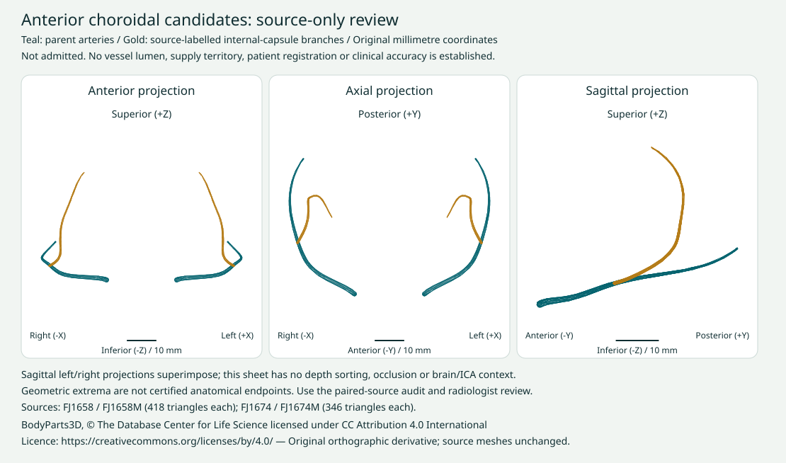

# Anterior choroidal source review — 30 September 2026

Status: **source-only candidates, not admitted or clinically approved**.
Baseline Atlas `eb6031b48e00faec4894c180f4c0d5a680847224`.
This advances a missing cerebral-artery chain without creating invented vessels.
Existing learner geometry, teaching, review decisions and website are unchanged.

| Official source concept | Original IS-A file | Triangles |
| --- | --- | --- |
| Right anterior choroidal artery, FMA50088 | FJ1658 | 418 |
| Left anterior choroidal artery, FMA50089 | FJ1658M | 418 |
| Branch to right posterior internal-capsule limb, FMA50146 | FJ1674 | 346 |
| Branch to left posterior internal-capsule limb, FMA50147 | FJ1674M | 346 |

## Evidence and inspection

The [machine audit](../content/anterior-choroidal-source-audit.json) checks exact
official source-table membership and SHA-256 identities, current and supplemental
holds, topology, original coordinate laterality, source owners and exact ordered
geometry matches. All 1,104 displayed definitions and 61 held source-file bounds
are screened, with nearby raw surfaces and explicit bilateral arterial controls.
No source cache is downloaded; absent or changed bytes fail closed.

Each candidate has one closed, consistently oriented component, no direct or
exact-shape displayed owner, and coordinates consistent with its official side.
Same-side branch approach to the parent is approximately 0.0088 mm. This does
**not** prove a patent junction, common wall, correct terminal or blood supply.
No shared exact triangle is required or used as evidence of clinical correctness.

The audit contains 119 surface comparisons, four parent/branch pairs and 16
geometric end-band probes against bilateral ICA and posterior communicating
arteries. Parent low-Y bands approach their same-side ICA by about 0.0703 mm;
high-Y bands are about 48.1 mm away. These are extrema, not asserted origin or
termination points.

One substantial-near-contact flag remains: **left parent artery versus the
displayed choroid plexus**. Approximately 32.7% of candidate vertices and 28.0%
of area-weighted centroids are within 0.25 mm of that surface. Unsigned samples
cannot determine adjacency, penetration, enclosure or duplication. This is an
explicit anatomical-review trigger, not a clearance or new source hold.



This reproducible sheet retains original coordinates and labels anatomical
sides, axes and scale. Transparent projections have no depth sorting or tissue
context; the sagittal sided sources superimpose. It is a source-review derivative,
not an angiogram, registration, validated anatomy illustration or public atlas
addition. Geometric end bands are inspection extrema, not certified endpoints.

## Factual references, not imported images

The primary [cadaveric anatomical study](https://pubmed.ncbi.nlm.nih.gov/16425152/)
supports inspecting ICA origin and optic-tract relationships; its abstract has
inconsistent printed percentages, so these are not adopted as prevalence data.

The primary [MR study](https://pmc.ncbi.nlm.nih.gov/articles/PMC7973945/)
provides origin/course landmarks using TOF source images and CISS. In that study,
small branches were not depicted; a generic surface must not promise visibility
of a capsule branch on a particular scan. These historical study findings guide
review, not current scan protocols or validation of this specimen.

No article prose, diagram, table, scan or publisher media is redistributed.

## Required next admission checks

1. Inspect parent origin/course against same-side ICA, posterior communicating
   artery, optic-tract and plexal anatomy in original 3D coordinates. Proximity
   alone is not identity, continuity, penetration or a tissue-plane proof.
2. Resolve substantial near-contact findings and whether the complete source
   concept and branch extent are anatomically appropriate. Exact-coordinate
   matching does not exclude translated, reflected or reindexed duplicates.
3. If admitted as draft surfaces, export originals through the established
   pipeline with exact source IDs, licence credit and unchanged source frame.
   Check side filters, selection/search, visibility, dissection, separation,
   camera framing and parent/branch teaching without claiming a lumen/territory.
4. Bind teaching, geometry and review evidence to the actual new revision.
   Radiologist approval remains separate and scoped to that revision; clinical
   approval does not follow from source-table, topology or software tests.
5. Real-image correspondence requires independently cleared cases, coordinate
   evidence and separate case/atlas/lecture access. Do not alter CT-head masks,
   accepted boundaries or the clinical desktop PACS.

## Licence and reproduction

The existing official [BodyParts3D licence](https://dbarchive.biosciencedbc.jp/en/bodyparts3d/lic.html)
specifies CC BY 4.0 and mandatory attribution. Credit is retained in the report
and derivative: **BodyParts3D, © The Database Center for Life Science licensed
under CC Attribution 4.0 International**. No paid service, model generation,
dependency, font or texture was added. The SVG uses system fonts.

```sh
npm run anterior-choroidal-source:test
# Reproduction requires the retained, verified original cache on C:
node scripts/audit-anterior-choroidal-source.mjs --check
node scripts/render-anterior-choroidal-review.mjs --check
```

The audit writes a new report only when explicitly generated; tests/check mode
do not mutate evidence. No publication, admission or sign-off is performed.
