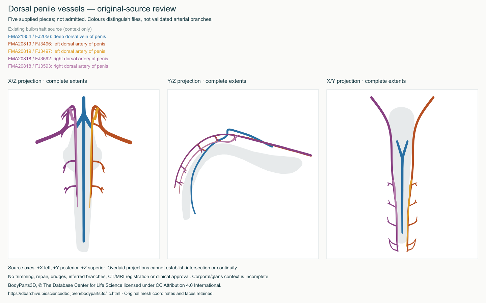

# Dorsal penile vascular candidates

Status: **source review only; not admitted to the learner atlas**. Three complete
BodyParts3D v4 IS-A definitions fill a genuine candidate coverage gap, but their
spatial relationships require adjudication before display. This work adds no
patient data, invented geometry, runtime controls or clinical approval.

| Archived definition | Complete source files | Source condition |
| --- | --- | --- |
| FMA21354, deep dorsal vein of penis | FJ2056 | One closed surface |
| FMA20819, left dorsal artery of penis | FJ3496 + FJ3497 | Two separate closed surfaces |
| FMA20818, right dorsal artery of penis | FJ3592 + FJ3593 | Two separate closed surfaces |

All five originals match official archive inventory sizes and CRCs and have
individual SHA-256 pins. They have no direct current display owners. The arterial
files remain wholly on the side indicated by the source (+X is left). The vein's
FJ2056 file also appears under the source alias FMA21240; these must not be counted
as two independent structures. Full alias and current-hold evidence is retained
in `dorsal-penile-source-audit.json`; absence of a hold is not admission approval.

## Spatial review



The figure shows each file separately coloured, with the admitted bulb/shaft
corpus-spongiosum source as translucent context. All candidate extents are shown
in X/Z, Y/Z and X/Y. No source vertex was moved and no faces were repaired,
smoothed or trimmed. The second arterial pieces have not been named as branches,
connected by invented bridges, or interpreted as complete vascular trees.

The audit screens all 1,104 current display roots, including the separately
admitted corpus-spongiosum source. It includes original-coordinate surface
comparisons, alias/exact-triangle checks and explicitly diagnostic translated
shape comparisons for eligible existing vessels. Translation is never applied
to the retained originals or review figure. Selected comparisons require exact
hash-pinned original files; missing originals fail rather than silently skip.

Ten cross-component pairs receive all-unique-vertex and all-triangle-centroid
distance diagnostics. The vein's close relationship to corpus spongiosum and
the displayed internal pudendal vein also receives full-point diagnostics.
Other catalogue comparisons use explicitly recorded sampling strides. Even
all-vertex/centroid distances are not continuous surface-to-surface minima:
they cannot rule out triangle intersections or demonstrate a patent lumen,
vascular connection, surgical plane or correct tissue identity.

The exhaustive vertex checks reveal much closer approach than coarse sampling:

| Original-coordinate comparison | Minimum measured vertex-to-surface distance |
| --- | --- |
| Left arterial pieces (smaller of both directions) | 0.000107 mm |
| Right arterial pieces (smaller of both directions) | 0.00391 mm |
| Deep dorsal vein vertices to displayed internal pudendal vein | 0.00177 mm |
| Deep dorsal vein vertices to corpus-spongiosum source | 0.01424 mm |

These very small measured values do not certify a gap or a join. The arterial
pieces remain independently closed meshes; apparent contact could include
overlap. No exact shared triangles were found in the selected current-catalogue
comparisons. The complete deterministic audit has SHA-256
`06cbb9b4202ab2468fd5b79e77cd5cbc42df1430f494fc0dd6743c4066ac8a86`.

Before admission, the radiologist should review:

1. Whether each complete arterial definition correctly represents the intended
   dorsal artery, including the long supplied extent and second disconnected
   piece. Decide whether a clearly labelled partial representation is acceptable.
2. The vein's relationship to the existing corpus-spongiosum source and displayed
   internal pudendal vein in true 3D, not projections alone. Near-contact is not
   proof of anatomical joining or nonintersection.
3. Missing corporal/glans context and whether alternative validated geometry is
   required. Existing held corporal/glans sources are not cleared by this audit.
4. Exact revision-bound identity, laterality and extent before educational
   release. No perfusion, flow, ultrasound target or patient correspondence is
   inferred from these source labels.

## Reproduction and retained evidence

From the Atlas checkout:

```sh
npm run dorsal-penile:audit
npm run dorsal-penile:review
```

The audit needs the existing exact-source cache in `../work/bodyparts3d`; its
comparison records identify required sources. The review checks five retained
originals in `content/prototypes/dorsal-penile-source-condition` against that
cache and reproduces the figure and metadata byte-for-byte. `originals.json`
retains archive-directory, inventory and original-file integrity evidence.
The scene and complete source faces remain unmodified. Figures are review
evidence, not CT/MRI images or clinical acceptance.

## Commercial reuse

BodyParts3D, © The Database Center for Life Science licensed under CC Attribution
4.0 International. See the [official source licence](https://dbarchive.biosciencedbc.jp/en/bodyparts3d/lic.html)
and [third-party notice](../LICENSES/THIRD_PARTY_NOTICES.md). Retain credit and
identify the colour/projection adaptation when redistributing the figure.
No publisher illustration, new dependency, font file or paid service is added.
