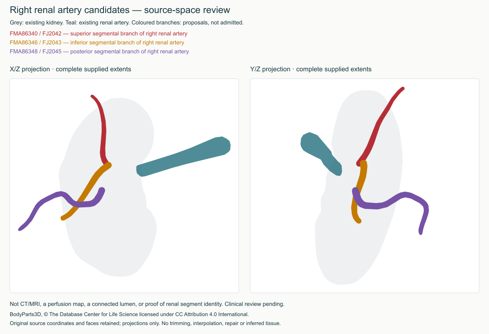
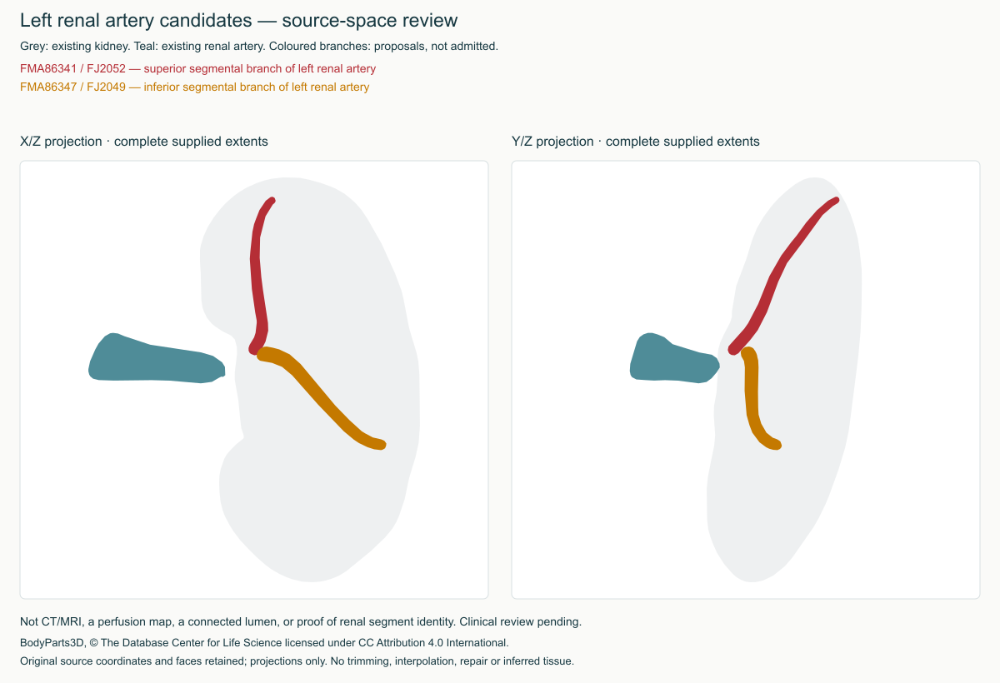

# Renal segmental artery candidates

Disposition: **source-only, not admitted**. This review adds no learner geometry,
teaching, registration, entitlement or website change. It does not alter the
existing renal study or global source-hold policy.

Five complete BodyParts3D v4 IS-A definitions were recovered and verified against
the official archive inventory (CRC, decompressed size and SHA-256). The audit
screens all 1,104 root and seven nested renal selection envelopes, then performs
102 bounded original-source comparisons and ten candidate-pair comparisons.
All five are single-component closed oriented combinatorial manifolds and remain
on their labelled side. No exact shared triangles were found. These checks do
not prove identity, nonintersection, continuity or clinical correctness.

| Source-labelled candidate | FMA / file | Sampled minimum to displayed parent artery |
| --- | --- | --- |
| Right superior segmental | FMA86340 / FJ2042 | 18.6 mm |
| Right inferior segmental | FMA86346 / FJ2043 | 19.4 mm |
| Right posterior segmental | FMA86348 / FJ2045 | 23.3 mm |
| Left superior segmental | FMA86341 / FJ2052 | 11.1 mm |
| Left inferior segmental | FMA86347 / FJ2049 | 14.5 mm |

Distances are unsigned vertex-to-surface samples, not certified full-surface
minimum distances or lumen measurements. Superior/inferior right candidates
have a sampled separation of 0.159 mm, which likewise does not establish joining.

## Visual evidence and decision





Both X/Z and Y/Z views retain complete source extents, including kidney and
displayed artery context. Visual inspection found visible separation from the
displayed main arteries. Some candidate portions project beyond the kidney
silhouette; the right posterior-labelled candidate has a broad inferior course.
These are review flags, not a diagnosis of mislabeled anatomy. No clipping,
translation, smoothing, interpolated connectors or repaired anatomy was used.

Before admission, the radiologist should adjudicate the five source identities,
extent relative to kidney/hilum, missing intervening branches and whether any
source is suitable for a clearly partial tree. Verify complete 3D relationships,
not these projections alone. Do not use these five meshes as a complete
segmental distribution, perfusion map or surgical model. Alternative sources or
separately authorised, validated segmentation may be needed; no patient scans
were accessed or uploaded for this audit.

## Reproduction

From the Atlas checkout, with the hash-pinned original source cache available:

```sh
npm run renal-segmental:audit
npm run renal-segmental:review
```

The first command verifies the saved deterministic audit, including current
source-hold evidence and catalogue bindings. The second reproduces both figures
and their metadata exactly, binding audit SHA-256
`5048193c716e778b7f7322a270719dfe43e2339b2fe1cde071da8c31102125e5`.
Raw originals remain in the local source cache and D recovery, not learner assets.
The audit samples bounded comparisons; it is not exhaustive intersection testing.

BodyParts3D, © The Database Center for Life Science licensed under CC Attribution
4.0 International. [Official terms](https://dbarchive.biosciencedbc.jp/en/bodyparts3d/lic.html).
Projection/annotation modifications and source pins are documented in the notices
and figure metadata. No new dependency, distributed font, texture or paid service.

Next: integrate the already verified Search study handoff into the website, then
continue substantive regional coverage. This unresolved candidate set does not
block other Atlas work; the full goal and revision-bound clinical review remain open.
