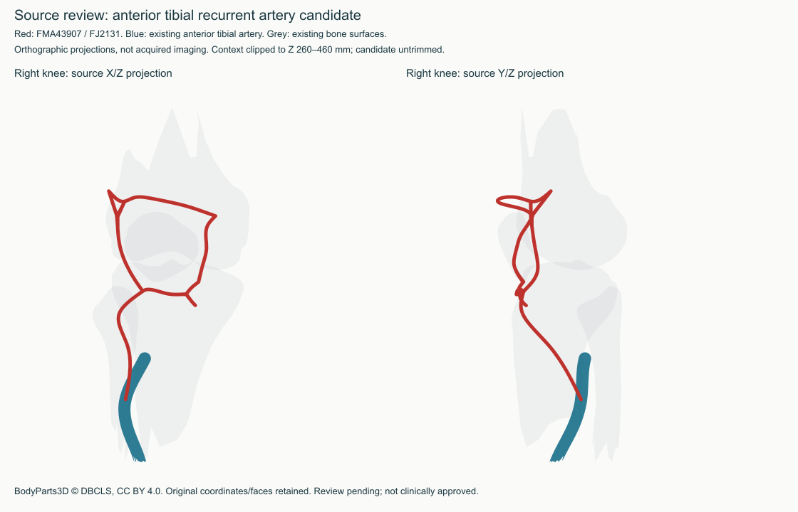
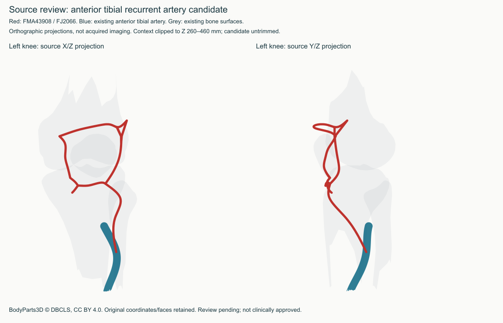

# Anterior tibial recurrent source review — 24 September 2026

Status: **held pending identity/extent review; neither candidate admitted**.
The full Atlas goal continues. This narrow source hold does not block unrelated
anatomy, viewer or teaching work and does not assert that the source is wrong.

## Findings

Official BodyParts3D v4 IS-A definitions provide one original file per side:

| Source definition | Original | SHA-256 |
| --- | --- | --- |
| FMA43908, left anterior tibial recurrent artery | FJ2066 | `3d8dfa081ffe9d4df00bfbb16104702aa3a5ff153bbd6e77cb2b49ef82538401` |
| FMA43907, right anterior tibial recurrent artery | FJ2131 | `23b75315a955162b26d754722f364c75073b52fdd7c4d7c079f94f74aba9ca2d` |

Archive size/CRC and source-table membership match. Both files have one closed,
consistently oriented manifold component, with 6,040 and 6,060 triangles
respectively and consistent side coordinates. They have no current direct
owners or represented exact-geometry match. The bounded screen of 1,104 displayed
definitions, 59 historical held components and both candidates produced 76
comparisons and no exact-shared-triangle or translated-similarity flag.
These are technical findings, not proof of correct anatomy or patent lumens.

Both original surfaces extend approximately 119.2 mm along source Z and form
broad anterior-knee loops in the source-space projections below. Their exact
extent as an isolated recurrent artery versus an associated network remains
unadjudicated. The [UAMS lower-limb artery reference](https://medicine.uams.edu/neuroscience/education/medical-school-courses/human-structure-module/anatomy-tables/artery-tables/arteries-of-the-lower-limb/)
describes the recurrent artery as a branch of the anterior tibial artery that
supplies the anterior knee/nearby muscles and contributes to the genicular
anastomosis. That supports anatomical context, not this individual mesh's extent.
No university figures, table wording or acquired scans were imported.

## Review packet





Red is the entire candidate; blue is the already supplied parent artery; grey
is existing femur/tibia/fibula/patella context. Source X/Z and Y/Z projections
have no patient/DICOM orientation claim. Context is clipped to the knee window;
the candidate bounds are checked to remain fully within it. The renderer uses
surface silhouettes, not transparent volumetric sections or lumen measurements.
The JSON next to each figure binds candidate, context and image hashes.
Visual proximity does not prove a junction or uninterrupted flow pathway.

Radiologist review should answer, against these exact source revisions:

1. Is the whole supplied extent suitable for the named arterial selection?
2. Does the loop require a broader network label or separate source replacement?
3. Are course, apparent connections and relationship to patella/tibia suitable
   for schematic teaching? Which limitations must be exposed to learners?

No answer is preselected. Record reviewer, date, exact hashes, accepted scope
and required corrections before changing the admission decision. Any correction
must retain original bytes and receive a new source/review revision; do not trim
or mirror a surface simply to make a current test pass.

## Enforced disposition and reproducibility

The original [audit](tibial-recurrent-source-audit.json) is immutable at SHA-256
`78d221460bddf648d3f1ef5eab3183fb594e3a515b93a0e8c70beeea848ace26`.
The separate [disposition](tibial-recurrent-source-disposition.json) adds both
complete definitions to the current source-hold policy. Same-tree shared-source
aliases are blocked as well. The historical source inventory is not relabelled,
and all 1,104 current displayed definitions remain free of these holds.

From the Atlas checkout:

```sh
node scripts/audit-tibial-recurrent-arteries.mjs --check
node scripts/render-tibial-recurrent-review.mjs
npm run tibial-recurrent-holds:test
npm run current-source-holds:test
```

Audit replay explicitly reconstructs the pre-disposition policy; this is not an
export bypass. Exporters must use `preflightCurrentSourceHolds`. The replay
refuses a changed baseline rather than silently broadening the evidence.
Original OBJs are in the local `work/bodyparts3d/isa` cache outside the repository;
the audit's `--fetch --check` can retrieve the two official pinned archive entries
when needed. The renderer also needs the previously retained context OBJs.
It writes only the two figures and their binding JSONs; a platform/font change
may change raster bytes and requires inspection and a new review binding.

Licence: [BodyParts3D CC BY 4.0](https://dbarchive.biosciencedbc.jp/en/bodyparts3d/lic.html),
with the required DBCLS credit embedded in each figure and preserved in notices.
No model, source scan/mask, entitlement, teaching approval or hosted version changes.
